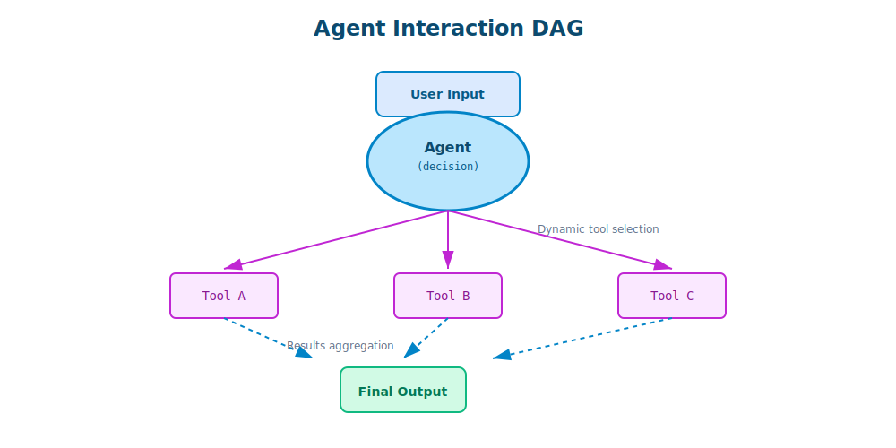
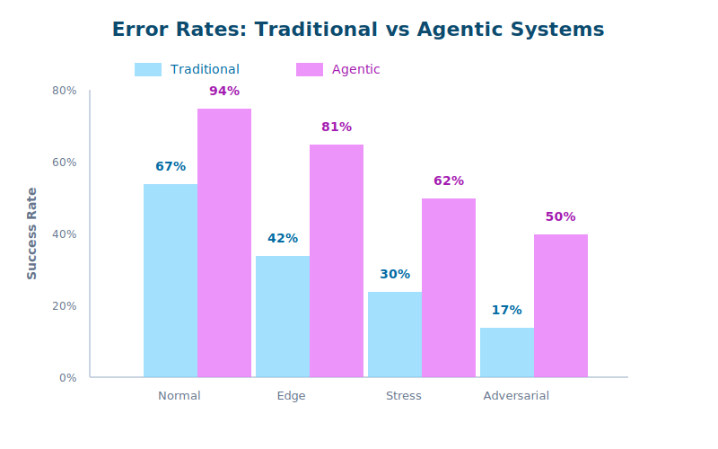

# Introduction to Agentic Reliability: Building Trustworthy AI Systems

*8 min read*

**Through my work with enterprise clients at companies like eBay, Mayo Clinic, and Trust & Will, I've developed a mathematical framework for testing agentic AI systems—addressing the fundamental challenge of how to validate systems that can't be fully predicted.**

---

## The Trust Paradox of Modern AI

Picture this: You've built an AI agent that can navigate your entire codebase, make intelligent decisions, and execute complex multi-step tasks. It works brilliantly... most of the time. But that "most" is precisely the problem. In enterprise environments, "mostly reliable" isn't reliable at all.

Working on production AI systems for Fortune 500 companies, I've wrestled with a fundamental question: **How do you mathematically prove that an AI system you can't fully predict is actually reliable?**

The answer isn't just about better testing—it's about reimagining reliability from first principles.


## Beyond Traditional Testing: The Agentic Challenge

Traditional software testing operates on a comfortable assumption: deterministic inputs produce deterministic outputs. Write a unit test, mock your dependencies, assert your expectations. Simple.

But agentic systems shatter this paradigm. When your AI agent can:
- Choose from multiple tools dynamically
- Invoke other agents recursively
- Adapt its strategy based on intermediate results
- Generate novel solutions to unexpected problems

...suddenly, your test matrix doesn't just grow—it explodes into infinite possibilities.

Consider a seemingly simple task: "Fix all the TypeScript errors in this project."

A traditional system might follow a predetermined path. But an agentic system might:
1. First analyze the project structure to understand dependencies
2. Identify common error patterns across files
3. Decide whether to fix errors file-by-file or pattern-by-pattern
4. Invoke specialized sub-agents for different error types
5. Validate fixes don't introduce new errors
6. Refactor code to prevent similar errors in the future

Each decision point branches into multiple possibilities, creating what we call the **"combinatorial explosion of agency."**

## A Graph-Theoretic Approach: Mathematical Rigor Meets Practical Reality

I've developed a novel approach that treats agentic interactions as directed acyclic graphs (DAGs), where each node represents a complete interaction cycle.

```
Traditional View:          Our Graph-Theoretic Model:
User → Agent → Response    Node: [(input, output)_agent]
                                     ↓
                          Node: [(query, result)_tool]
```

This isn't just elegant mathematics—it's a practical framework that enables:

- **Predictable Testing**: By modeling interactions as graphs, we can systematically explore state spaces
- **Reliability Metrics**: Quantifiable measures of system behavior across thousands of scenarios
- **Failure Pattern Analysis**: Identifying not just when systems fail, but why and how



## The Power of Idempotent Design

A key innovation in this framework is enforcing idempotency at the architectural level. Every agent is designed to be stateless and deterministic for a given input and context. This means:

- **Reproducible Failures**: When something goes wrong, we can replay the exact scenario
- **Confident Debugging**: Issues aren't hidden in complex state interactions
- **Scalable Testing**: We can run thousands of parallel tests without side effects

Here's how this looks in practice:

```python
class IdempotentAgent:
    def __init__(self, system_prompt: str, tools: List[Tool]):
        self.system_prompt = system_prompt
        self.tools = tools
        # No mutable state here!

    def execute(self, input: str, context: Context) -> Response:
        # Pure function: same input + context = same output
        return self.process_with_llm(input, context)
```

## Real Impact: From Theory to Production

This isn't academic exercise. This reliability testing framework has been deployed in production systems across:

- **Financial Services**: Automated compliance checking
- **Healthcare**: Clinical decision support systems
- **Enterprise Software**: Large-scale code generation and refactoring

## The Surprising Discovery: Consistency Emerges from Chaos

Perhaps the most fascinating finding is what I call "emergent consistency." When you properly structure agentic systems with:
- Clear boundaries (our DAG nodes)
- Idempotent operations
- Comprehensive observability

...something remarkable happens. The system becomes *more* predictable than traditional software in certain scenarios. Why? Because AI agents can adapt to edge cases that would break rigid code paths.



## What This Means for Enterprise AI

For engineering leaders evaluating AI adoption, this reliability framework addresses the core concern: **Can we trust AI agents with critical business processes?**

The answer is increasingly yes—but only with the right architectural foundation. The framework provides:

1. **Quantifiable Risk Assessment**: Know exactly how reliable your AI systems are
2. **Audit Trails**: Complete visibility into every decision and action
3. **Graceful Degradation**: Systems that fail safely and predictably
4. **Continuous Improvement**: Learn from every interaction to improve reliability

## Looking Ahead

This reliability testing framework represents a new approach to validating agentic AI systems, providing:

- Quantifiable reliability metrics
- Reproducible testing methodologies
- Production-ready architectural patterns
- Mathematical foundations for AI system validation

## Next in This Series

The following posts dive deeper into the mathematical and practical foundations:

- **The Mathematics of Trust**: Graph theory and Bayesian approaches to AI reliability
- **Building a Testing Framework**: From theory to production implementation

---

*This work was developed through consulting engagements with Fortune 500 companies including eBay, Mayo Clinic, and Trust & Will, working through Artium AI.*