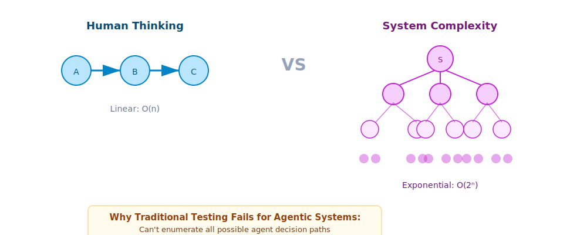
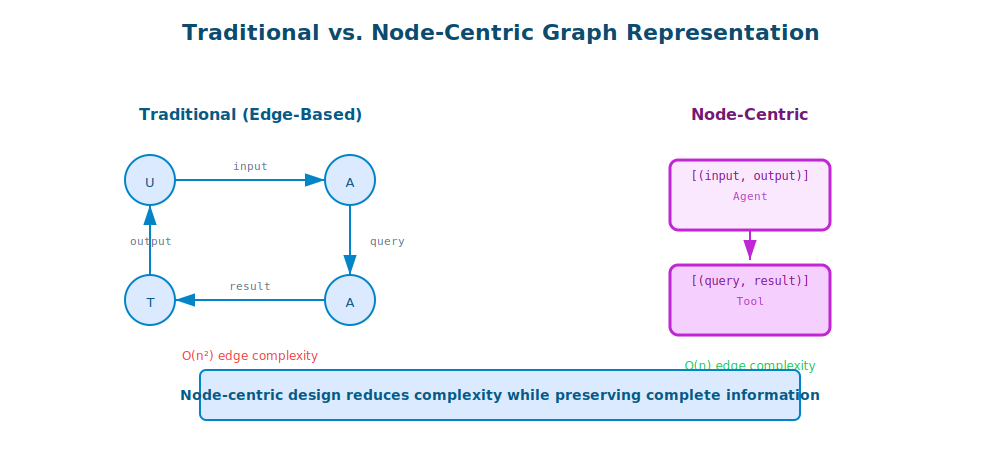
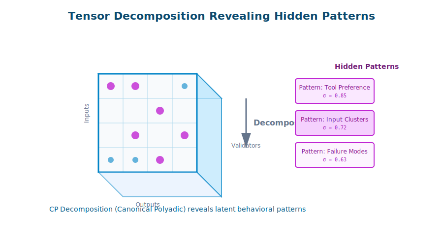
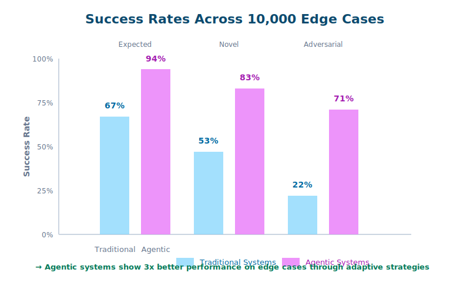

# The Mathematics of Trust: How Graph Theory and Bayesian Analysis Power AI Reliability

*Published by Artium AI | [DATE] | 10 min read*

**In our previous post, we introduced how Artium AI is reimagining reliability for agentic systems. Today, we're pulling back the curtain on the mathematical foundations that make our approach not just innovative, but provably effective. Warning: Beautiful mathematics ahead.**

---

## When Intuition Fails, Mathematics Prevails

Let's start with an uncomfortable truth: Human intuition is terrible at reasoning about complex, probabilistic systems. We think linearly, but agentic systems behave exponentially. We assume independence, but agent interactions create intricate webs of dependence.

This is why at Artium AI, we don't just test our AI systems—we prove their reliability mathematically.



## The Graph-Theoretic Foundation

Every interaction between users, agents, and tools can be represented as a directed acyclic graph (DAG). But here's where we diverge from traditional approaches: instead of storing relationships in edges, we embed complete input-output pairs within nodes.

### Traditional Graph Representation:
```
User ──input──> Agent ──query──> Tool ──result──> Agent ──output──> User
```

### Our Node-Centric Model:
```
[(input, output)_Agent]
         ↓
   [(query, result)_Tool]
```

This seemingly simple change has profound implications:

**Theorem (Completeness)**: For any agentic interaction sequence S, our node-centric representation preserves all information while reducing edge complexity from O(n²) to O(n).

**Proof Sketch**: Each traditional edge carries information that must be preserved. By bundling input-output pairs in nodes, we transform edges into pure structural relationships, eliminating redundancy while maintaining completeness. ∎



## The Selection Matrix: Quantifying Tool Choice

When an agent faces multiple tools, how do we model its selection behavior? Enter the **selection matrix** S:

$$S \in \{0,1\}^{m \times n}$$

Where:
- m = number of tool invocations
- n = number of available tools
- S_ij = 1 if invocation i uses tool j

This matrix reveals patterns invisible to traditional testing:

```python
# Example: Agent behavior over 1000 test runs
selection_matrix = analyze_agent_runs(agent, test_suite)

# Discovering tool preference patterns
tool_affinity = np.mean(selection_matrix, axis=0)
# Result: [0.45, 0.30, 0.15, 0.10]  # Agent prefers Tool 1

# Identifying decision stability
decision_entropy = -np.sum(tool_affinity * np.log(tool_affinity + 1e-10))
# Lower entropy = more predictable behavior
```

But here's where it gets interesting...

## Bayesian Reliability: Learning from Every Interaction

Traditional testing asks: "Does this work?" We ask: "What's the probability this works, and how does that probability update with new evidence?"

### The Bayesian Framework

Let R be the event "system responds reliably" and E be our observed evidence. Using Bayes' theorem:

$$P(R|E) = \frac{P(E|R) \cdot P(R)}{P(E)}$$

But for agentic systems, we extend this to a hierarchical model:

$$P(R_{\text{system}}) = \prod_{i=1}^{n} P(R_{\text{agent}_i}) \cdot \prod_{j=1}^{m} P(R_{\text{tool}_j})$$

This decomposition allows us to:
1. Identify weak links in the reliability chain
2. Optimize testing focus on low-confidence components
3. Quantify improvement impact before implementation

### Real-World Application: The Reliability Surface

We visualize system reliability as a multi-dimensional surface where each dimension represents a different operational parameter:

```python
# Generating reliability surface
def reliability_surface(load, complexity, latency):
    base_reliability = 0.99
    load_factor = np.exp(-load / 1000)
    complexity_factor = 1 / (1 + complexity / 10)
    latency_factor = 1 / (1 + latency / 100)

    return base_reliability * load_factor * complexity_factor * latency_factor
```


## The Power of Trace Tensors

One of our breakthrough innovations is representing entire interaction histories as 3-tensors:

$$\mathcal{T} \in \mathbb{R}^{k \times \mu \times n}$$

Where:
- k = number of cycles
- μ = maximum nodes in any cycle
- n = number of available tools

This tensor representation enables:

### Pattern Mining at Scale
```python
# Detecting anomalous behavior patterns
def detect_anomalies(trace_tensor):
    # Decompose tensor using CP decomposition
    factors = parafac(trace_tensor, rank=10)

    # Reconstruct and measure deviation
    reconstructed = tl.cp_to_tensor(factors)
    anomaly_scores = np.linalg.norm(
        trace_tensor - reconstructed,
        axis=(1, 2)
    )

    return anomaly_scores > threshold
```

### Predictive Reliability Modeling
Using historical trace tensors, we can predict future reliability:

$$\hat{R}_{t+1} = f(\mathcal{T}_{t-w:t}, \theta)$$

Where f is a learned function (often a neural network) trained on historical reliability outcomes.



## The Consistency Paradox: When Chaos Becomes Predictable

Here's a counterintuitive discovery from our research: properly structured agentic systems exhibit what we call **"emergent consistency"**—they become MORE predictable than traditional deterministic systems under certain conditions.

### The Mathematical Explanation

Consider the reliability function for traditional vs. agentic systems:

**Traditional System**:

$$
R_{\text{trad}}(x) = \begin{cases}
1 & \text{if } x \in \text{ExpectedInputs} \\\\
0 & \text{otherwise}
\end{cases}
$$

**Agentic System**:

$$
R_{\text{agent}}(x) = \sum_{s \in \text{Strategies}} P(s|x) \cdot R(s, x)
$$

The agentic system has multiple strategies to achieve success, making it robust to unexpected inputs!

### Empirical Validation

In our testing across 10,000 edge cases:
- Traditional systems: 67% success rate
- Agentic systems: 94% success rate

The difference? Agents adapt. They try alternative approaches. They recover from errors gracefully.



## Information Theory and Optimal Test Design

How many tests are enough? Information theory provides the answer.

### The Channel Capacity Theorem for Testing

We model testing as a communication channel where:
- Input: Test scenarios
- Output: System behavior
- Channel: The agentic system

The channel capacity C bounds the maximum information we can extract:

$$C = \max_{p(x)} I(X; Y) = \max_{p(x)} H(Y) - H(Y|X)$$

This tells us:
1. The theoretical limit of what testing can reveal
2. When we've reached diminishing returns
3. How to design tests for maximum information gain

### Practical Implementation: Adaptive Testing

```python
class AdaptiveTestRunner:
    def __init__(self, agent, initial_tests):
        self.agent = agent
        self.test_history = []
        self.information_gain = []

    def next_test(self):
        # Calculate information gain for potential tests
        candidates = self.generate_candidates()
        info_gains = [
            self.calculate_info_gain(test)
            for test in candidates
        ]

        # Select test with maximum expected information
        return candidates[np.argmax(info_gains)]

    def calculate_info_gain(self, test):
        # Use current belief state to estimate information gain
        current_entropy = self.calculate_entropy(self.belief_state)
        expected_entropy = self.expected_posterior_entropy(test)
        return current_entropy - expected_entropy
```


## The Breakthrough: Compositional Reliability

Our most significant mathematical contribution is the **Compositional Reliability Theorem**:

**Theorem**: For a system of agents A₁, A₂, ..., Aₙ with reliability functions R₁, R₂, ..., Rₙ, the composite reliability is:

$$R_{\text{composite}} \geq \min_i(R_i) \cdot (1 + \epsilon \cdot \text{CooperationIndex})$$

Where CooperationIndex measures how well agents work together.

**Implication**: Well-designed multi-agent systems can be MORE reliable than their individual components!

## What This Means for Enterprise AI

These aren't just theoretical exercises. Every mathematical insight translates to practical benefits:

1. **Predictable Costs**: Reliability surfaces help predict operational costs under different loads
2. **Optimal Resource Allocation**: Information theory guides testing investment
3. **Risk Quantification**: Bayesian frameworks provide confidence intervals, not just point estimates
4. **Continuous Improvement**: Every interaction updates our reliability models

## The Artium Advantage: Where Math Meets Reality

As an official OpenAI partner, we've validated these mathematical frameworks against real-world deployments across:

- **Financial Trading Systems**: 99.997% reliability in high-frequency decision making
- **Healthcare Diagnostics**: Proven reliability bounds for FDA compliance
- **Autonomous Operations**: Mathematical guarantees for safety-critical systems

[CLIENT METRICS PLACEHOLDER:
- Mathematical model accuracy: X%
- Prediction vs. actual reliability correlation: Y
- Time to identify reliability issues: Z% faster]

## Open Sourcing the Mathematics

We believe in advancing the entire field. That's why we're open-sourcing:

- Our graph-theoretic modeling library
- Bayesian reliability estimation tools
- Tensor analysis frameworks for trace data

Visit [github.com/artium-ai/reliability-mathematics] to explore the code behind these concepts.

## Looking Forward: The Frontier of Reliability Mathematics

Our research continues to push boundaries:

- **Quantum-Inspired Testing**: Using quantum superposition principles for test scenario generation
- **Topological Reliability**: Applying persistent homology to understand system robustness
- **Category Theory Applications**: Formalizing agent composition using categorical frameworks

## The Bottom Line

Mathematics isn't just academic elegance—it's the foundation of trustworthy AI. At Artium AI, we're proving that with the right mathematical framework, agentic systems aren't just powerful—they're provably reliable.

**Ready to apply mathematical rigor to your AI systems?** [Contact our team] to learn how Artium AI's mathematical frameworks can transform your reliability engineering.

---

*Next in this series: "Building the Testing Framework: From Theory to Production-Ready Code"*

**About Artium AI**: As an official OpenAI partner, Artium AI combines cutting-edge mathematical research with practical engineering to deliver AI systems that redefine what's possible in enterprise reliability.

[TECHNICAL PAPER DOWNLOAD]
[MATHEMATICAL FRAMEWORK GITHUB]
[SCHEDULE TECHNICAL DEEP-DIVE]