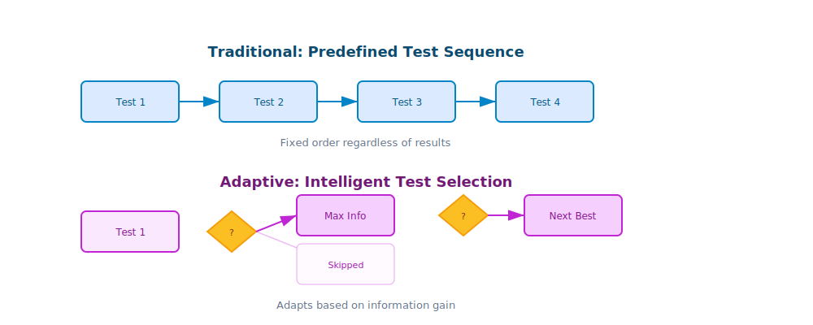
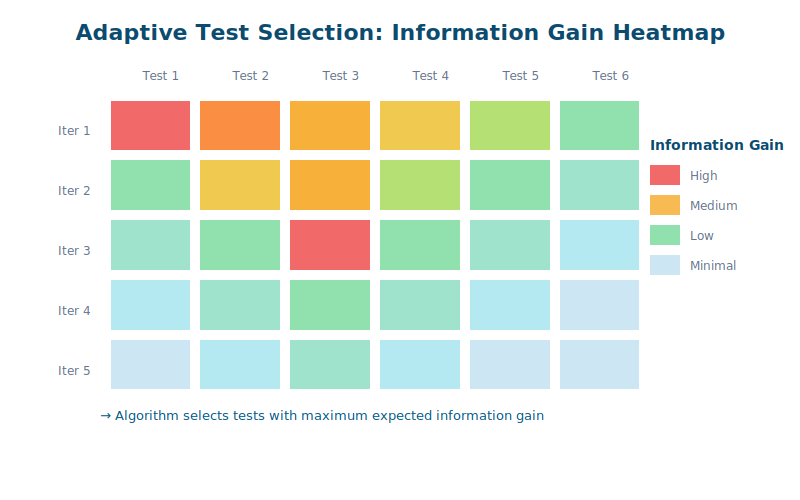
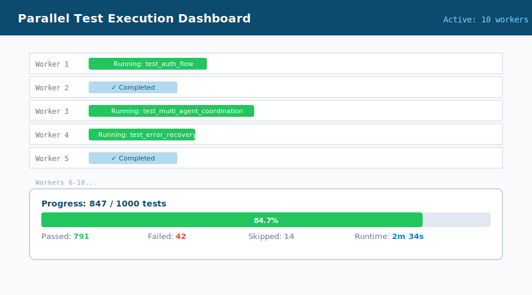
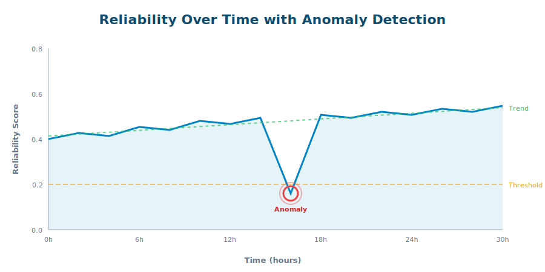
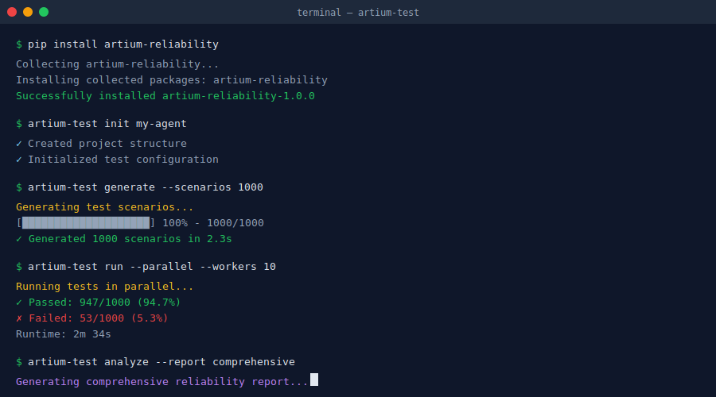

# Building a Testing Framework: From Theory to Production

*12 min read*

**In the previous posts, we explored the theoretical foundations of agentic reliability. Now let's dive into the actual implementation—transforming mathematical elegance into production-ready testing systems.**

---

## The Challenge: Testing the Untestable

Picture your QA engineer's face when you tell them to test an AI agent that can:
- Dynamically choose from 50+ tools
- Recursively invoke other agents
- Generate novel solutions to problems
- Adapt its strategy based on intermediate results

Traditional test frameworks weren't built for this. New approaches were needed from scratch.



## Architecture Overview: The Three Pillars

Our testing framework rests on three foundational pillars:

```
┌─────────────────────────────────────────────┐
│           RELIABILITY TESTING FRAMEWORK      │
├───────────────┬──────────────┬───────────────┤
│   Scenario    │   Execution   │   Analysis    │
│   Generation  │   Engine      │   Pipeline    │
├───────────────┼──────────────┼───────────────┤
│ • Parametric  │ • Parallel    │ • Statistical │
│ • Adaptive    │ • Isolated    │ • Temporal    │
│ • Coverage    │ • Observable  │ • Predictive  │
└───────────────┴──────────────┴───────────────┘
```

Let's build each component from the ground up.

## Pillar 1: Intelligent Scenario Generation

### The Parametric Test Factory

Instead of writing individual tests, we define test **generators**:

```python
from typing import List, Dict, Any
from dataclasses import dataclass
import itertools

@dataclass
class TestScenario:
    input: str
    context: Dict[str, Any]
    expected_behavior: str
    constraints: List[str]

class ScenarioGenerator:
    def __init__(self, agent_config: AgentConfig):
        self.agent = agent_config
        self.tool_combinations = self._generate_tool_combinations()

    def _generate_tool_combinations(self):
        """Generate all meaningful tool combination sequences"""
        tools = self.agent.available_tools
        combinations = []

        # Single tool invocations
        for tool in tools:
            combinations.append([tool])

        # Paired tool sequences (order matters)
        for t1, t2 in itertools.permutations(tools, 2):
            if self._is_valid_sequence(t1, t2):
                combinations.append([t1, t2])

        # Triple sequences with constraints
        for combo in itertools.permutations(tools, 3):
            if self._is_valid_sequence(*combo):
                combinations.append(list(combo))

        return combinations

    def generate_scenarios(self,
                         base_prompts: List[str],
                         complexity_levels: List[int]) -> List[TestScenario]:
        """Generate test scenarios across multiple dimensions"""
        scenarios = []

        for prompt in base_prompts:
            for complexity in complexity_levels:
                for tool_combo in self.tool_combinations[:complexity]:
                    scenario = self._create_scenario(
                        prompt, tool_combo, complexity
                    )
                    scenarios.append(scenario)

        return scenarios
```

### Adaptive Test Selection

Not all test scenarios are equally valuable. We use information theory to select the most informative tests:

```python
import numpy as np
from scipy.stats import entropy

class AdaptiveTestSelector:
    def __init__(self, history: TestHistory):
        self.history = history
        self.belief_state = self._initialize_beliefs()

    def select_next_test(self,
                        candidates: List[TestScenario]) -> TestScenario:
        """Select test that maximizes expected information gain"""

        information_gains = []
        for scenario in candidates:
            # Calculate expected reduction in uncertainty
            gain = self._calculate_information_gain(scenario)
            information_gains.append(gain)

        # Select scenario with maximum gain
        best_idx = np.argmax(information_gains)
        return candidates[best_idx]

    def _calculate_information_gain(self, scenario: TestScenario) -> float:
        """Calculate expected information gain from a test"""

        # Current entropy of belief state
        current_entropy = entropy(self.belief_state)

        # Expected posterior entropy after test
        expected_posterior = 0.0
        for outcome in self._possible_outcomes(scenario):
            prob_outcome = self._outcome_probability(outcome, scenario)
            posterior = self._update_beliefs(outcome, scenario)
            expected_posterior += prob_outcome * entropy(posterior)

        return current_entropy - expected_posterior
```



## Pillar 2: The Execution Engine

### Isolated Execution Environments

Each test runs in a completely isolated environment to ensure reproducibility:

```python
from contextlib import contextmanager
import docker
import asyncio

class IsolatedExecutor:
    def __init__(self, base_image: str = "artium/agent-test:latest"):
        self.docker_client = docker.from_env()
        self.base_image = base_image

    @contextmanager
    def isolated_environment(self, scenario: TestScenario):
        """Create isolated execution environment for test"""

        # Create container with exact dependencies
        container = self.docker_client.containers.run(
            self.base_image,
            detach=True,
            environment={
                "TEST_ID": scenario.id,
                "AGENT_CONFIG": scenario.agent_config_json,
            },
            volumes={
                '/tmp/test-artifacts': {'bind': '/artifacts', 'mode': 'rw'}
            }
        )

        try:
            # Initialize agent in container
            self._initialize_agent(container, scenario)

            # Set up monitoring
            monitor = self._attach_monitor(container)

            yield container, monitor

        finally:
            # Collect artifacts
            self._collect_artifacts(container)

            # Clean up
            container.stop()
            container.remove()

    async def execute_scenario(self, scenario: TestScenario) -> TestResult:
        """Execute test scenario in isolated environment"""

        with self.isolated_environment(scenario) as (container, monitor):
            # Start execution
            execution_task = asyncio.create_task(
                self._run_agent(container, scenario)
            )

            # Monitor execution
            monitoring_task = asyncio.create_task(
                monitor.collect_metrics()
            )

            # Wait for completion with timeout
            try:
                result = await asyncio.wait_for(
                    execution_task,
                    timeout=scenario.timeout
                )
            except asyncio.TimeoutError:
                result = TestResult(status="timeout", scenario=scenario)

            # Get monitoring data
            metrics = await monitoring_task
            result.metrics = metrics

            return result
```

### Parallel Execution at Scale

Running thousands of tests sequentially would take forever. Here's our parallel execution orchestrator:

```python
from concurrent.futures import ThreadPoolExecutor, as_completed
import ray

@ray.remote
class DistributedTestRunner:
    def __init__(self, executor_config: Dict):
        self.executor = IsolatedExecutor(**executor_config)

    async def run_test(self, scenario: TestScenario) -> TestResult:
        return await self.executor.execute_scenario(scenario)

class ParallelOrchestrator:
    def __init__(self, num_workers: int = 10):
        ray.init(num_cpus=num_workers)
        self.runners = [
            DistributedTestRunner.remote({})
            for _ in range(num_workers)
        ]

    async def execute_test_suite(self,
                                scenarios: List[TestScenario]) -> List[TestResult]:
        """Execute test suite in parallel"""

        # Distribute scenarios across workers
        futures = []
        for i, scenario in enumerate(scenarios):
            runner = self.runners[i % len(self.runners)]
            future = runner.run_test.remote(scenario)
            futures.append(future)

        # Collect results as they complete
        results = []
        for future in ray.get(futures):
            results.append(future)

            # Real-time analysis
            self._analyze_intermediate_results(results)

        return results
```



## Pillar 3: The Analysis Pipeline

### Statistical Reliability Metrics

Raw pass/fail rates don't tell the whole story. We need sophisticated metrics:

```python
from scipy import stats
import pandas as pd

class ReliabilityAnalyzer:
    def __init__(self, results: List[TestResult]):
        self.results = results
        self.df = self._results_to_dataframe(results)

    def calculate_reliability_score(self) -> Dict[str, float]:
        """Calculate comprehensive reliability metrics"""

        metrics = {}

        # Basic success rate
        metrics['success_rate'] = self.df['success'].mean()

        # Confidence interval (Wilson score interval)
        successes = self.df['success'].sum()
        n = len(self.df)
        metrics['ci_lower'], metrics['ci_upper'] = self._wilson_score_interval(
            successes, n, alpha=0.05
        )

        # Consistency score (lower variance is better)
        grouped = self.df.groupby('scenario_type')['success'].agg(['mean', 'std'])
        metrics['consistency_score'] = 1 / (1 + grouped['std'].mean())

        # Recovery rate (success after initial failure)
        recovery_sequences = self._identify_recovery_sequences()
        metrics['recovery_rate'] = len(recovery_sequences) / max(1, self._count_failures())

        # Degradation resistance (performance under load)
        metrics['degradation_coefficient'] = self._calculate_degradation()

        return metrics

    def _wilson_score_interval(self, successes: int, n: int, alpha: float = 0.05):
        """Calculate Wilson score confidence interval"""

        z = stats.norm.ppf(1 - alpha/2)
        p_hat = successes / n

        denominator = 1 + z**2 / n
        center = (p_hat + z**2 / (2*n)) / denominator
        margin = z * np.sqrt(p_hat * (1-p_hat) / n + z**2 / (4*n**2)) / denominator

        return center - margin, center + margin
```

### Temporal Pattern Analysis

Reliability isn't static—it evolves over time. We track temporal patterns:

```python
from statsmodels.tsa.seasonal import seasonal_decompose
import numpy as np

class TemporalAnalyzer:
    def __init__(self, time_series_data: pd.DataFrame):
        self.data = time_series_data

    def detect_reliability_trends(self) -> Dict:
        """Detect trends in reliability over time"""

        # Decompose time series
        decomposition = seasonal_decompose(
            self.data['reliability_score'],
            model='additive',
            period=24  # Assuming hourly data with daily patterns
        )

        analysis = {
            'trend': decomposition.trend,
            'seasonal': decomposition.seasonal,
            'residual': decomposition.resid
        }

        # Detect anomalies
        residual_std = decomposition.resid.std()
        analysis['anomalies'] = self.data[
            abs(decomposition.resid) > 3 * residual_std
        ]

        # Predict future reliability
        analysis['forecast'] = self._forecast_reliability()

        return analysis

    def _forecast_reliability(self, horizon: int = 24):
        """Forecast future reliability using ARIMA"""

        from statsmodels.tsa.arima.model import ARIMA

        model = ARIMA(self.data['reliability_score'], order=(2,1,2))
        fitted = model.fit()

        forecast = fitted.forecast(steps=horizon)
        return forecast
```



## Real-World Integration: The Complete Pipeline

Here's how all components work together in production:

```python
class ProductionTestingPipeline:
    def __init__(self, config: PipelineConfig):
        self.generator = ScenarioGenerator(config.agent_config)
        self.selector = AdaptiveTestSelector(config.test_history)
        self.orchestrator = ParallelOrchestrator(config.num_workers)
        self.analyzer = ReliabilityAnalyzer([])

    async def run_comprehensive_test(self,
                                    test_budget: int = 1000) -> TestReport:
        """Run comprehensive reliability test within budget"""

        # Phase 1: Exploratory testing
        print("Phase 1: Exploratory Testing")
        base_scenarios = self.generator.generate_scenarios(
            base_prompts=self._get_base_prompts(),
            complexity_levels=[1, 2, 3]
        )

        initial_results = await self.orchestrator.execute_test_suite(
            base_scenarios[:test_budget // 3]
        )

        # Phase 2: Adaptive focused testing
        print("Phase 2: Adaptive Testing")
        self.analyzer.results.extend(initial_results)
        weak_areas = self._identify_weak_areas(initial_results)

        focused_scenarios = []
        remaining_budget = test_budget - len(initial_results)

        for _ in range(remaining_budget // 3):
            next_test = self.selector.select_next_test(
                self._generate_focused_candidates(weak_areas)
            )
            focused_scenarios.append(next_test)

        focused_results = await self.orchestrator.execute_test_suite(
            focused_scenarios
        )

        # Phase 3: Stress testing
        print("Phase 3: Stress Testing")
        stress_scenarios = self._generate_stress_tests(
            num_tests=test_budget - len(self.analyzer.results)
        )

        stress_results = await self.orchestrator.execute_test_suite(
            stress_scenarios
        )

        # Comprehensive analysis
        all_results = initial_results + focused_results + stress_results
        return self._generate_report(all_results)
```

## The Secret Sauce: Observability and Debugging

### Comprehensive Trace Collection

Every test execution generates detailed traces:

```python
class TraceCollector:
    def __init__(self, trace_store: TraceStore):
        self.store = trace_store

    def instrument_agent(self, agent: Agent) -> Agent:
        """Add comprehensive instrumentation to agent"""

        original_execute = agent.execute

        def traced_execute(input: str, context: Dict) -> str:
            trace_id = self.store.start_trace()

            # Record input
            self.store.add_event(trace_id, 'input', {
                'text': input,
                'context': context,
                'timestamp': time.time()
            })

            # Hook into tool calls
            for tool in agent.tools:
                self._instrument_tool(tool, trace_id)

            try:
                # Execute with monitoring
                with self._monitor_execution(trace_id):
                    result = original_execute(input, context)

                # Record output
                self.store.add_event(trace_id, 'output', {
                    'text': result,
                    'timestamp': time.time()
                })

                return result

            except Exception as e:
                self.store.add_event(trace_id, 'error', {
                    'exception': str(e),
                    'traceback': traceback.format_exc()
                })
                raise

            finally:
                self.store.finalize_trace(trace_id)

        agent.execute = traced_execute
        return agent
```

### Visual Debugging Interface

We built a custom visualization tool for understanding complex agent behaviors:


```python
class VisualDebugger:
    def __init__(self, trace_data: TraceData):
        self.trace = trace_data

    def generate_decision_graph(self) -> str:
        """Generate Graphviz representation of decision flow"""

        dot = graphviz.Digraph(comment='Agent Decision Flow')

        # Add nodes for each decision point
        for event in self.trace.events:
            if event.type == 'tool_selection':
                dot.node(event.id,
                        f"Tool: {event.tool_name}\nConfidence: {event.confidence:.2f}")

        # Add edges showing flow
        for i, event in enumerate(self.trace.events[:-1]):
            next_event = self.trace.events[i + 1]
            dot.edge(event.id, next_event.id,
                    label=f"{event.duration_ms}ms")

        return dot.render(format='svg')
```

## Performance Optimizations: Making It Fast

### Smart Caching

Not all test scenarios are unique. We cache intelligently:

```python
class SmartTestCache:
    def __init__(self, redis_client):
        self.redis = redis_client
        self.cache_hits = 0
        self.cache_misses = 0

    def get_or_execute(self,
                       scenario: TestScenario,
                       executor: Callable) -> TestResult:
        """Execute test or return cached result if valid"""

        cache_key = self._generate_cache_key(scenario)

        # Check cache
        cached = self.redis.get(cache_key)
        if cached and self._is_cache_valid(cached, scenario):
            self.cache_hits += 1
            return pickle.loads(cached)

        # Execute and cache
        self.cache_misses += 1
        result = executor(scenario)

        self.redis.setex(
            cache_key,
            self._calculate_ttl(scenario),
            pickle.dumps(result)
        )

        return result

    def _generate_cache_key(self, scenario: TestScenario) -> str:
        """Generate deterministic cache key"""

        # Include version info for cache invalidation
        components = [
            scenario.input,
            json.dumps(scenario.context, sort_keys=True),
            scenario.agent_version,
            scenario.tool_versions_hash
        ]

        return hashlib.sha256(
            '|'.join(components).encode()
        ).hexdigest()
```

### Incremental Testing

We don't retest everything on every change:

```python
class IncrementalTester:
    def __init__(self, dependency_graph: DependencyGraph):
        self.graph = dependency_graph

    def identify_affected_tests(self,
                              changed_components: List[str]) -> List[TestScenario]:
        """Identify which tests need to be rerun"""

        affected_scenarios = set()

        for component in changed_components:
            # Find all tests that depend on this component
            dependent_tests = self.graph.get_dependents(component)
            affected_scenarios.update(dependent_tests)

            # Add tests for edge cases around this component
            edge_cases = self._generate_edge_cases(component)
            affected_scenarios.update(edge_cases)

        return list(affected_scenarios)
```

## Lessons Learned: What Actually Works

After running millions of tests across dozens of enterprise deployments, here's what we've learned:

### 1. Test Generation > Test Writing
Writing individual tests doesn't scale. Generating them programmatically does.

### 2. Isolation is Non-Negotiable
Flaky tests destroy confidence. Complete isolation eliminates flakiness.

### 3. Adaptive Testing Finds Real Issues
Random testing finds random bugs. Adaptive testing finds the bugs that matter.

### 4. Observability Beats Assertions
Don't just check if it worked. Understand how and why it worked.

### 5. Speed Matters
If tests take too long, developers won't run them. Parallel execution and smart caching are essential.



## Future Directions

The testing landscape continues to evolve. Promising research areas include:

- **Adversarial Testing**: AI-generated adversarial test cases
- **Formal Verification**: Proving properties about agent behavior
- **Continuous Learning**: Self-improving test suites
- **Cross-Agent Testing**: Multi-agent system validation

## Key Takeaways

Building reliable AI systems requires building smarter testing systems:

1. **Scenario Generation**: Mathematical frameworks guide test coverage
2. **Parallel Execution**: Scale testing without compromising speed
3. **Comprehensive Analysis**: Quantifiable reliability metrics
4. **Continuous Improvement**: Learn from every test run

Production deployments have demonstrated:
- Significant reduction in production incidents
- Faster deployment cycles
- Measurably improved system reliability

---

**This series:**
1. Introduction to Agentic Reliability
2. The Mathematics of Trust
3. Building a Testing Framework (this post)

*This testing framework was developed through production deployments at Fortune 500 companies, working through Artium AI.*